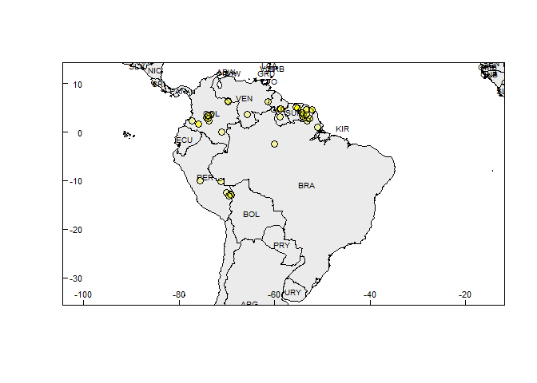
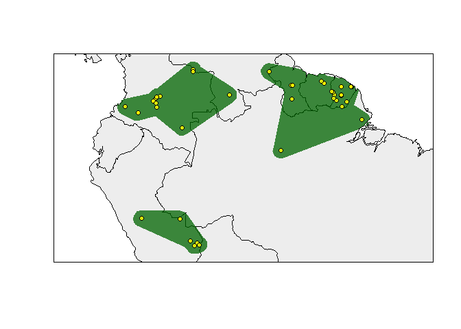
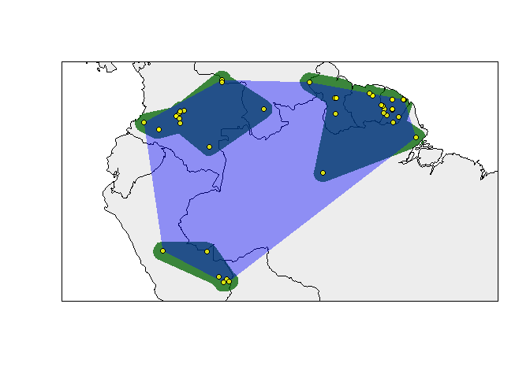
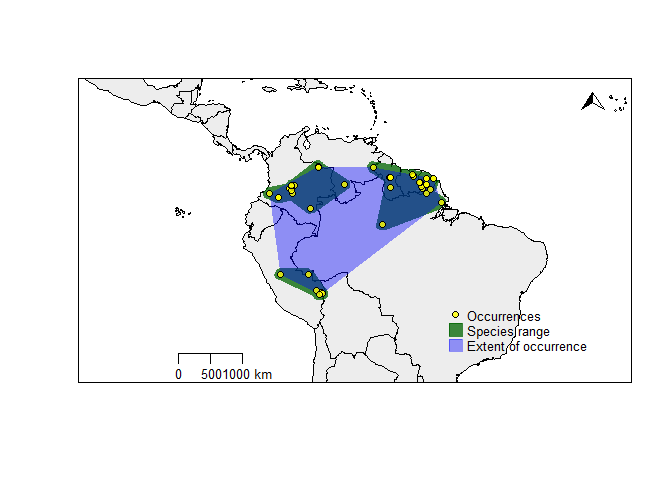

rangemap: Simple Tools for Defining Species Ranges
================
2020-05-16

  - [Project description](#project-description)
      - [Estatus of the project](#estatus-of-the-project)
  - [Package description](#package-description)
  - [Installing the package](#installing-the-package)
  - [Using the package functions](#using-the-package-functions)
      - [Preparing R](#preparing-r)
      - [Simple graphical exploration of your
        data.](#simple-graphical-exploration-of-your-data.)
      - [Species ranges from buffered
        occurrences](#species-ranges-from-buffered-occurrences)
      - [Species ranges from
        boundaries](#species-ranges-from-boundaries)
      - [Species ranges from hull
        polygons](#species-ranges-from-hull-polygons)
      - [Species ranges from ecological niche
        models](#species-ranges-from-ecological-niche-models)
      - [Species ranges using trend surface
        analyses](#species-ranges-using-trend-surface-analyses)
      - [Nice figures of species
        ranges](#nice-figures-of-species-ranges)
      - [Species ranges and environmental
        factors](#species-ranges-and-environmental-factors)

<br>

**This repository is for the GSoC 2018 project “Species range maps in
R”.**

## Project description

Student: *Marlon E. Cobos*

Mentors: *Narayani Barve, Vijay Barve, and Alberto Jiménez Valverde*

The species range maps project is motivated by the importance of
information about species distribution for processes of conservation
planning and the study of spatial patterns of biodiversity. In the face
of multiple threats related to Global Change, protection and mitigation
actions are crucial for maintaining the health of the planet, and
knowing where species are located constitutes in primary information for
starting these efforts. Currently, generation of species ranges maps may
take several steps and the use of specialized software. Thanks to the
recent development of specialized packages, R is rapidly becoming an
excellent alternative for analyzing the spatial patterns of
biodiversity. Taking advantage of these packages and the versatility of
R, the aim of this project was offering handily and robust open source
tools to obtain reliable proposals of species distribution ranges and to
analyze their geographical patterns. A large community of students,
researchers, and conservation managers can be benefited by this project
since these tools will be freely available and will improve the way in
which studies of species distributions are developed.

### Estatus of the project

At the moment we have completed all the proposed tasks. Some of the
planned functions were not developed since other packages have similar
functionalities. Instead, we created other functions not considered
initially but that complement this package with useful options for
visualization. Next steps include massive testing of this package
functions and submitting it to CRAN.

All commits made can be seen at the
<a href="https://github.com/marlonecobos/rangemap/commits/master" target="_blank">complete
list of commits</a>.

Following you can find a brief description of the produced R package, as
well as some examples of its use.

<br>

## Package description

The **rangemap** R package presents various tools to create species
range maps based on occurrence data, statistics, and SpatialPolygon
objects. Other tools of this package can be used to analyze
environmental characteristics of the species ranges and to create high
quality figures of these maps. All the functions that create species
ranges also generate an approach to the species extent of occurrence
(using convex hulls) and the area of occupancy according to the IUCN
criteria. Shapefiles of the resultant polygons can be saved in the
working directory if it is needed.

<br>

## Installing the package

**rangemap** is in a GitHub repository and can be installed and/or
loaded using the following code (make sure to have Internet connection).

``` r
# Installing and loading packages
if(!require(devtools)){
    install.packages("devtools")
}

if(!require(rangemap)){
    devtools::install_github("marlonecobos/rangemap")
}
library(rangemap)
```

<br>

## Using the package functions

### Preparing R

The following code chunk installs (if needed) and loads the R packages
that will be used to get and prepare some data for performing the
example analyses with the **rangemap** package.

``` r
# pacakges from CRAN
pcakages <- c("spocc", "maps", "maptools", "raster")
req_packages <- pcakages[!(pcakages %in% installed.packages()[, "Package"])]
if (length(req_packages) > 0) {
  install.packages(req_packages, dependencies = TRUE)
}
sapply(pcakages, require, character.only = TRUE)
```

The working directory will also be defined in this part.

``` r
# working directory
setwd("YOUR/WORKING/DIRECTORY") # YOUR/WORKING/DIRECTORY
```

<br>

### Simple graphical exploration of your data.

The *rangemap\_explore* function generates simple figures to visualize
species occurrence data in the geographic space before using other
functions of this package. The figure created with this function helps
to identify countries involved in the species distribution. Other
aspects of the species distribution can also be generally checked here;
for instance, disjunct distributions, general dimension of the species
range, etc.

The function’s help can be consulted using the following line of code:

``` r
help(rangemap_explore)
```

An example of the use of this function is written below.

``` r
# getting the data from GBIF
occ <- occ(query = "Dasypus kappleri", limit = 1000) 
occ <- occ$gbif$data$Dasypus_kappleri

# keeping only georeferenced records
occ_d <- occ[!is.na(occ$latitude) & !is.na(occ$longitude),
             c("name", "longitude", "latitude")]
```

A simple figure.

``` r
# simple figure of the species occurrence data
rangemap_explore(occurrences = occ_d)
```

<!-- -->

Same figure with country codes.

``` r
# simple figure of the species occurrence data
rangemap_explore(occurrences = occ_d, show_countries = TRUE)
```

<!-- -->

<br>

### Species ranges from buffered occurrences

The *rangemap\_buff* function generates a distributional range for a
given species by buffering provided occurrences using a user-defined
distance.

The function’s help can be consulted using the following line of code:

``` r
help(rangemap_buff)
```

An example of the use of this function is written below.

``` r
# getting the data from GBIF
occ <- occ(query = "Peltophryne empusa", limit = 1000) 
occ <- occ$gbif$data$Peltophryne_empusa

# keeping only georeferenced records
occ_p <- occ[!is.na(occ$latitude) & !is.na(occ$longitude),
             c("name", "longitude", "latitude")]

# buffer distance
dist <- 100000
save <- FALSE # TRUE if you want to save the shapefiles in the working directory 
name <- "Test"

buff_range <- rangemap_buff(occurrences = occ_p, buffer_distance = dist,
                            save_shp = save, name = name)
```

The function *rangemap\_fig* generates customizable figures of species
range maps using the objects produced by other function of this package.
Let’s see how the generated range looks like.

``` r
# creating the species range figure
rangemap_fig(buff_range, zoom = 1.2)
```

<!-- -->

For further details see the function help.

``` r
help(rangemap_fig)
```

<br>

### Species ranges from boundaries

The *rangemap\_bound* function generates a distributional range for a
given species by considering all the polygons of administrative entities
in which the species has been detected.

The function’s help can be consulted using the following line of code:

``` r
help(rangemap_bound)
```

Examples of the use of this function with most of its variants are
written below.

<br>

#### Using only occurrences

Following there is an example in which administrative areas will be
selected using only occurrences. The *rangemap\_explore* function will
be used for obtaining a first visualization of the species
distributional range.

``` r
# data from GBIF for this species was downloaded in the first example

# checking which countries may be involved in the analysis
rangemap_explore(occurrences = occ_d, show_countries = TRUE)
```

<!-- -->

``` r
level <- 0
dissolve <- FALSE
save <- FALSE # TRUE if you want to save the shapefiles in the working directory 
name <- "test1"
countries <- c("PER", "BRA", "COL", "VEN", "ECU", "GUF", "GUY", "SUR", "BOL")

bound_range <- rangemap_bound(occurrences = occ_d, country_code = countries, boundary_level = level, 
                              dissolve = dissolve, save_shp = save, name = name)
```

Figure of the generated range.

``` r
# creating the species range figure
rangemap_fig(bound_range)
```

<!-- -->

<br>

#### Using only administrative area names

Following there is an example in which administrative areas will be
selected using only the names of the administrative entities known to be
occupied by the species. This approach may be useful in circumstances
where geographic coordinates or accurate locality descriptions do not
exist.

``` r
# administrative areas invloved
data("country_codes") #list of country names and ISO codes
head(country_codes)
```

    ##   Country_or_Area_Name ISO_ALPHA.2_Code ISO_ALPHA.3_Code
    ## 1          Afghanistan               AF              AFG
    ## 2        Aland Islands               AX              ALA
    ## 3              Albania               AL              ALB
    ## 4              Algeria               DZ              DZA
    ## 5       American Samoa               AS              ASM
    ## 6              Andorra               AD              AND
    ##   ISO_Numeric_Code_UN_M49_Numerical_Code
    ## 1                                      4
    ## 2                                    248
    ## 3                                      8
    ## 4                                     12
    ## 5                                     16
    ## 6                                     20

``` r
# View(country_codes) # if you want to see the complete list

level <- 0
adm <- c("Ecuador", "Peru", "Venezuela", "Colombia", "Brazil") # If we only know the countries in wich the species is
dissolve <- FALSE
save <- FALSE # TRUE if you want to save the shapefiles in the working directory 
name <- "test2"
countries <- c("PER", "BRA", "COL", "VEN", "ECU", "GUF", "GUY", "SUR", "BOL")

bound_range1 <- rangemap_bound(adm_areas = adm, country_code = countries, boundary_level = level,
                               dissolve = dissolve, save_shp = save, name = name)
```

Map of the generated range.

``` r
# creating the species range figure
rangemap_fig(bound_range1)
```

<!-- -->

<br>

#### Using occurrences and administrative areas

An example of using both occurrences and administrative areas for
creating species ranges with the function *rangemap\_bound* is presented
below. This option may be useful when these two types of information
complement the knowledge of the species distribution.

``` r
# occurrences from GBIF were downloaded in a previous step, see (occ_d)
# other parameters
level <- 0
adm <- "Ecuador" # Athough no record is on this country, we know it is in Ecuador
dissolve <- FALSE
save <- FALSE # TRUE if you want to save the shapefiles in the working directory 
name <- "test3"
countries <- c("PER", "BRA", "COL", "VEN", "ECU", "GUF", "GUY", "SUR", "BOL")

bound_range2 <- rangemap_bound(occurrences = occ_d, adm_areas = adm, country_code = countries,
                               boundary_level = level, dissolve = dissolve, save_shp = save, name = name)
```

Map of the species range.

``` r
# creating the species range figure
rangemap_fig(bound_range2)
```

<!-- -->

<br>

### Species ranges from hull polygons

The *rangemap\_hull* function generates a species range polygon by
creating convex or concave hull polygons based on occurrence data.

The function’s help can be consulted using the following line of code:

``` r
help(rangemap_hull)
```

Examples of the use of this function with most of its variants are
written below.

<br>

#### Convex hulls

With the example provided below, a species range will be constructed
using convex hulls. After that this range will be split based on two
distinct algorithms of clustering: hierarchical and k-means. Convex hull
polygons are commonly used to represent species ranges, however in
circumstances where biogeographic barriers for the species dispersal
exist, concave hulls may be a better option.

``` r
# occurrences from GBIF were downloaded in a previous step, see (occ_d)
# unique polygon (non-disjunct distribution)
dist <- 100000
hull <- "convex" 
split <- FALSE
save <- FALSE # TRUE if you want to save the shapefiles in the working directory
name <- "test4"

hull_range <- rangemap_hull(occurrences = occ_d, hull_type = hull, buffer_distance = dist,
                            split = split, save_shp = save, name = name)
```

    ## 
    ## Hull type: convex

``` r
# disjunct distributions
## clustering occurrences with the hierarchical method
split <- TRUE
c_method <- "hierarchical"
split_d <- 1500000
name <- "test5"

hull_range1 <- rangemap_hull(occurrences = occ_d, hull_type = hull, buffer_distance = dist,
                             split = split, cluster_method = c_method, split_distance = split_d,
                             save_shp = save, name = name)
```

    ## 
    ## Clustering method: hierarchical
    ## 
    ## Hull type: convex

``` r
## clustering occurrences with the k-means method
c_method <- "k-means"
n_clus <- 3
name <- "test6"

hull_range2 <- rangemap_hull(occurrences = occ_d, hull_type = hull, buffer_distance = dist,
                             split = split, cluster_method = c_method, n_k_means = n_clus,
                             save_shp = save, name = name)
```

    ## 
    ## Clustering method: k-means
    ## 
    ## Hull type: convex

Now the figure of the species range.

``` r
# creating the species range figure
rangemap_fig(hull_range) # try hull_range1 and hull_range2 as well
```

<!-- -->

<br>

#### Concave hulls

With the following examples, the species range will be constructed using
concave hulls. The species range will be calculated as an only area and
as disjunct areas by clustering its occurrences using the k-means and
hierarchical methods.

``` r
# occurrences from GBIF were downloaded in a previous step, see (occ_d)
# unique polygon (non-disjunct distribution)
dist <- 100000
hull <- "concave" 
split <- FALSE
save <- FALSE # TRUE if you want to save the shapefiles in the working directory
name <- "test7"

hull_range3 <- rangemap_hull(occurrences = occ_d, hull_type = hull, buffer_distance = dist,
                             split = split, save_shp = save, name = name)
```

    ## 
    ## Hull type: concave

``` r
# disjunct distributions
## clustering occurrences with the hierarchical method
split <- TRUE
c_method <- "hierarchical"
split_d <- 1500000
name <- "test8"

hull_range4 <- rangemap_hull(occurrences = occ_d, hull_type = hull, buffer_distance = dist,
                             split = split, cluster_method = c_method, split_distance = split_d,
                             save_shp = save, name = name)
```

    ## 
    ## Clustering method: hierarchical
    ## 
    ## Hull type: concave

``` r
## clustering occurrences with the k-means method
c_method <- "k-means"
n_clus <- 3
name <- "test9"

hull_range5 <- rangemap_hull(occurrences = occ_d, hull_type = hull, buffer_distance = dist,
                             split = split, cluster_method = c_method, n_k_means = n_clus,
                             save_shp = save, name = name)
```

    ## 
    ## Clustering method: k-means
    ## 
    ## Hull type: concave

Checking the figure.

``` r
# creating the species range figure
rangemap_fig(hull_range5) # try hull_range4 and hull_range5 as well
```

<!-- -->

<br>

### Species ranges from ecological niche models

The *rangemap\_enm* function generates a distributional range for a
given species using a continuous raster layer produced with an
ecological niche modeling algorithm. This function binarizes the model
into suitable and unsuitable areas using a user specified level of
omission (a given threshold value).

The function’s help can be consulted using the following line of code:

``` r
help(rangemap_enm)
```

An example of the use of this function is written below.

``` r
# parameters
sp_mod <- raster::raster(list.files(system.file("extdata", package = "rangemap"),
                                    pattern = "sp_model.tif", full.names = TRUE))
sp_train <- read.csv(list.files(system.file("extdata", package = "rangemap"),
                                pattern = "sp_train.csv", full.names = TRUE))
occ_sp <- data.frame("A_americanum", sp_train)
thres <- 5
save <- FALSE # TRUE if you want to save the shapefiles in the working directory
name <- "test10"

enm_range <- rangemap_enm(occurrences = occ_sp, model = sp_mod, threshold_omission = thres,
                          save_shp = save, name = name)
```

Let’s see how this range looks like.

``` r
# creating the species range figure
rangemap_fig(enm_range)
```

<!-- -->

<br>

### Species ranges using trend surface analyses

The *rangemap\_tsa* function generates species range polygons for a
given species using a trend surface analysis. Trend surface analysis is
a method based on low-order polynomials of spatial coordinates for
estimating a regular grid of points from scattered observations. This
method assumes that all cells not occupied by occurrences are absences;
hence its use depends on the quality of data and the certainty of having
or not a complete sampling of the region of interest.

The function’s help can be consulted using the following line of code:

``` r
help(rangemap_tsa)
```

An example of the use of this function is written below.

``` r
# getting the data from GBIF
occ <- occ(query = "Peltophryne fustiger", limit = 1000) 
occ <- occ$gbif$data$Peltophryne_fustiger

# keeping only georeferenced records
occ_f <- occ[!is.na(occ$latitude) & !is.na(occ$longitude),
             c("name", "longitude", "latitude")]

# region of interest
WGS84 <- CRS("+proj=longlat +datum=WGS84 +ellps=WGS84 +towgs84=0,0,0")
w_map <- map(database = "world", regions = "Cuba", fill = TRUE, plot = FALSE) # map of the world
w_po <- sapply(strsplit(w_map$names, ":"), function(x) x[1]) # preparing data to create polygon
reg <- map2SpatialPolygons(w_map, IDs = w_po, proj4string = WGS84) # map to polygon

# other data
res <- 1
thr <- 0
save <- FALSE # TRUE if you want to save the shapefiles in the working directory
name <- "test11"

tsa_r <- rangemap_tsa(occurrences = occ_f, region_of_interest = reg, threshold = thr,
                      resolution = res, save_shp = save, name = name)
```

Let’s take a look at the results.

``` r
# creating the species range figure with a polygon defined by the user
rangemap_fig(tsa_r, polygons = reg, zoom = 3)
```

<!-- -->

<br>

### Nice figures of species ranges

The *rangemap\_fig* function can be used to plot not only the generated
species ranges but also the extent of occurrence and the species records
in the same map. The species range will be plot on a simplified world
map, but users can use a SpatialPolygon object of their choice.

The function’s help can be consulted using the following line of code:

``` r
help(rangemap_fig)
```

Examples of the use of this function are written below.

#### Including extent of occurrence

``` r
# arguments for the species range figure
extent <- TRUE

# creating the species range figure (hull_range5 was gnerated in a previous example)
rangemap_fig(hull_range5, add_extent = extent)
```

<!-- -->

<br>

#### Including occurrences

``` r
# arguments for the species range figure
occ <- TRUE

# creating the species range figure (hull_range5 was gnerated in a previous example)
rangemap_fig(hull_range5, add_occurrences = occ)
```

<!-- -->

<br>

#### Including extent of occurrence and species records

``` r
# arguments for the species range figure
extent <- TRUE
occ <- TRUE

# creating the species range figure (hull_range5 was gnerated in a previous example)
rangemap_fig(hull_range5, add_extent = extent, add_occurrences = occ)
```

<!-- -->

<br>

#### Using other parameters

``` r
# arguments for the species range figure
extent <- TRUE
occ <- TRUE
legend <- TRUE # leggend of objects included
scale <- TRUE # scale bar
north <- TRUE # north arrow
zoom1 <- 1.4 # normally 1


# creating the species range figure (hull_range5 was gnerated in a previous example)
rangemap_fig(hull_range5, add_extent = extent, add_occurrences = occ,
             legend = legend, scalebar = scale, scalebar_length = 500, 
             zoom = zoom1, northarrow = north)
```

<!-- -->

<br>

#### Saving the figure

``` r
# arguments for the species range figure
extent <- TRUE
occ <- TRUE
legend <- TRUE # leggend of objects included
scale <- TRUE # scale bar
north <- TRUE # north arrow
save <-  TRUE # FALSE by default

# creating the species range figure (hull_range5 was gnerated in a previous example)
range_map <- rangemap_fig(hull_range5, add_extent = extent, add_occurrences = occ,
                          legend = legend, scalebar = scale, scalebar_length = 500, 
                          northarrow = north, zoom = zoom1, save_fig = save)
```

<br>

### Species ranges and environmental factors

#### Species ranges on environmental factor maps

The *ranges\_emaps* function represents one or more ranges of the same
species on various maps of environmental factors (e.g. climatic
variables) to detect implications of using one or other type of range
regarding the environmental conditions in the area. Figures can be saved
using some of the function arguments.

The function’s help can be consulted using the following line of code:

``` r
help(ranges_emaps)
```

An example of the use of this function is written below.

``` r
# occurrences from GBIF were downloaded in a previous step, see (occ_d)
# range based on buffers
dist1 <- 500000

buff <- rangemap_buff(occurrences = occ_d, buffer_distance = dist1)


# range based on concave hulls
dist2 <- 250000
hullt <- "concave"

concave <- rangemap_hull(occurrences = occ_d, hull_type = hullt, buffer_distance = dist2)
```

    ## 
    ## Hull type: concave

``` r
# range based on convex disjunct hulls
split3 <- TRUE
hullt1 <- "convex"

convex <- rangemap_hull(occurrences = occ_d, hull_type = hullt1, buffer_distance = dist1,
                        split = split3, cluster_method = "k-means", n_k_means = 3)
```

    ## 
    ## Clustering method: k-means
    ## 
    ## Hull type: convex

``` r
# list of ranges
ranges <- list(buff, concave, convex)
names(ranges) <- c("buff", "concave", "convex_split")

# preparing environmental variables
## geting bioclimatic variables (some of them)
vars <- getData("worldclim", var = "bio", res = 5)[[c("bio1", "bio7", "bio12", "bio15")]]
## after the first view try with distinct or more variables

## mask variables to the region of interest
WGS84 <- CRS("+proj=longlat +datum=WGS84 +ellps=WGS84 +towgs84=0,0,0")
w_map <- map(database = "world", regions = c("Ecuador", "Peru", "Bolivia", "Colombia", "Venezuela",
                                             "Suriname", "Guyana", "French Guyana", "Brazil"),
             fill = TRUE, plot = FALSE) # map of the world

w_po <- sapply(strsplit(w_map$names, ":"), function(x) x[1]) # preparing data to create polygon
reg <- map2SpatialPolygons(w_map, IDs = w_po, proj4string = WGS84) # map to polygon

e <- extent(reg)
mask <- as(e, 'SpatialPolygons')

## variables to be used in the analysis
variables <- crop(vars, mask)

# ranges on evironmental factor maps (figure can be saved using other parameters, see help)
ranges_emaps(ranges = ranges, variables = variables)
```

<!-- -->

<br>

#### Species ranges in the environmental space

The *ranges\_espace* function generates a three dimensional comparison
of a species’ ranges created using distinct algorithms, to visualize
implications of selecting one of them if environmental conditions are
considered.

The function’s help can be consulted using the following line of code:

``` r
help(ranges_espace)
```

An example of the use of this function is written below.

``` r
# list of ranges
ranges1 <- list(buff, concave) # this ranges were created in the previous exercise
names(ranges1) <- c("buff", "concave")

# bioclimatic variables for environmental comparisson
vars <- getData("worldclim", var = "bio", res = 5)

variables <- crop(vars, mask)

# comparison
occur <- TRUE
env_comp <- ranges_espace(ranges = ranges1, add_occurrences = occur, variables = variables)

# use the created object to see again the figure
env_comp

# you can zoom in and rotate the figure for understanding it better
```

Since saving this figures for publication may be challenging, following
you will find lines of code that will allow you to do it.

``` r
op <- options() # save default options
options(viewer = NULL) # set viewer to web browser
name <- "ranges_space" # name for figure

# using web browser to save image
env_comp %>% htmlwidgets::onRender(
paste("function(el, x)
{var gd = document.getElementById(el.id);
Plotly.downloadImage(gd, {format: 'svg', width: ", 1000, ", height: ",
800, ", filename: ", paste("\'", name, "\'", sep = ""), "});
}", sep = "")
)

Sys.sleep(2) # waiting for the execution
options(viewer = op$viewer) # restore viewer to old setting (e.g. RStudio)
```
